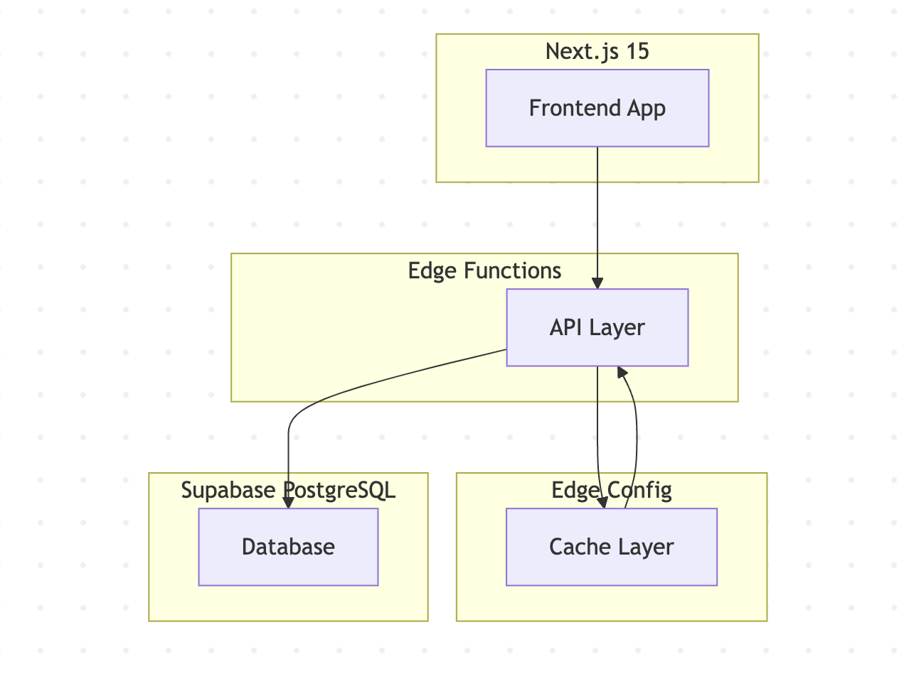
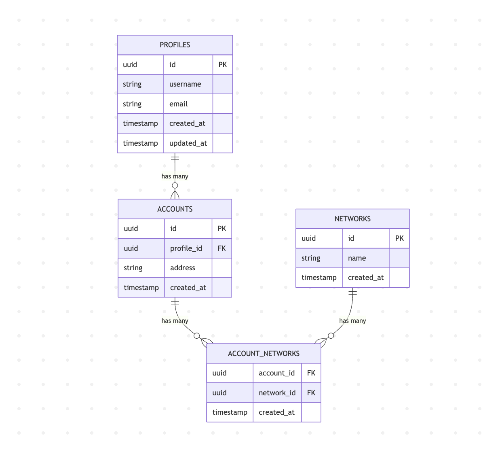

# Hormesis - Architecture & Design

## 🎯 Overview

Hormesis is a modern web3 profile management application built with Next.js 15, featuring real-time profile search, infinite scroll, and edge-optimized performance. The application provides a seamless experience for viewing and discovering blockchain profiles across multiple networks.
Note: data is mocked and does not retrieves actual on-chain data

## 🏗️ High-Level Architecture



## 📱 Application Features

### Home Page (`/`)

- **Infinite Scroll**: Displays all web3 profiles with seamless pagination
- **Advanced Search**: Real-time search across multiple criteria:
  - Blockchain networks (Ethereum, Base, Optimism, etc.)
  - Wallet addresses (full or partial)
  - Email addresses
  - Profile names/usernames
- **Responsive Design**: Optimized for desktop and mobile devices
- **Loading States**: Skeleton components and suspense boundaries for smooth UX

### Profile Page (`/profile/[address]`)

- **Profile Details**: Comprehensive view of individual profile data
- **Account Information**: Display of associated wallet addresses
- **Network Activity**: Show networks where the profile is active
- **Metadata Display**: Username, email, labels, and other profile attributes

## 🛠️ Technical Stack

### Frontend

- **Next.js 15**: Latest version with App Router
- **React Server Components (RSC)**: For improved performance and SEO
- **Client Components**: For interactive features and state management
- **TanStack Query**: Advanced data fetching and caching
- **TypeScript**: Type-safe development
- **Tailwind CSS**: Utility-first styling
- **Shadcn components**

### Backend

- **Vercel Edge Functions**: Serverless API endpoints
- **Edge Config**: Caching layer for improved performance (not implemented)
- **Supabase**: PostgreSQL database with real-time capabilities

### Infrastructure

- **Vercel Platform**: Global edge network deployment
- **Turborepo**: Monorepo build system for faster deployments
- **Edge Network**: Global CDN for optimal performance

## 🔌 API Endpoints

### Profiles API

- `GET /api/profiles` - Get paginated list of profiles
  - Query params: `cursor` (pagination), `search` (search term)
- `GET /api/profile/[address]` - Get specific profile by blockchain address (address being a wallet address)

### Example API Response

```json
{
  "profiles": [
    {
      "username": "Vitalik",
      "email": "vitalik@example.com",
      "accounts": {
        "0xd8dA6BF26964aF9D7eEd9e03E53415D37aA96045": {
          "networks": ["Mainnet", "Base", "Optimism"]
        }
      },
      "labels": ["DeFi User", "NFT Collector"]
    }
  ],
  "nextCursor": "next_page_token"
}
```

## 🚀 Performance Optimizations

### Next.js 15 Features

- **Suspense Boundaries**: Stream async data on completion
- **Static/Dynamic Generation**: Hybrid rendering strategies
- **Streaming**: Progressive loading of page content

### Data Fetching Strategy

- **TanStack Query Integration**:
  - Pre-fetch client-side queries in RSC
  - Pre-fetching before clicking on links
  - Intelligent caching rules
  - Background refetching

### Caching Strategy

- **Edge Config**: Global caching layer (Not implemented)
- **TanStack Query**: Client-side cache
- **Next.js Cache**: Built-in caching mechanisms
- **CDN**: Vercel's global edge network

## 📊 Database Schema

The database is designed with normalization principles to optimize query performance and maintain data integrity.



### Indexes

- profile -> username
- profile -> email
- accounts -> address
- accounts -> profile_id
- account_networks -> account_id
- account_networks -> network_id

For fast query when requesting profile for specific address / networks / name ...

## 🔍 Search Implementation

### Search Criteria

- **Network-based**: Filter by blockchain networks
- **Address-based**: Full or partial wallet address matching
- **Email-based**: Email address search
- **Name-based**: Username/profile name search

## 🔮 Future Enhancements

### Features

- **Real World Data**: Feed database with real-world data (probably need some backend service to index relevant data)
- **Live Data Update**: Profile data should be up to date (same probably have some kind of service that could listen in real-time)

### Technical Improvements

- **Tests** unit and integrations for the API
- **API Rate Limiting**: Add API Rate Limiting using Vercel Firewall
- **Edge Config Implementation**: Complete caching layer
- **Monitoring**: Enhanced observability tools
